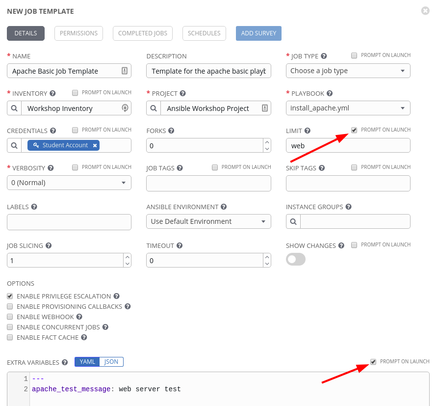
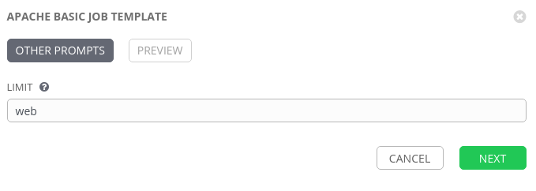
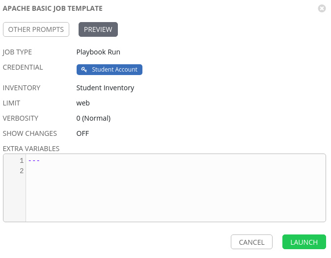
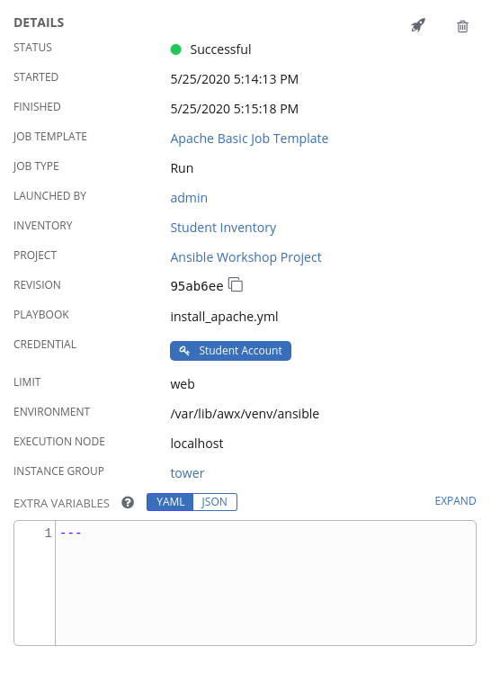
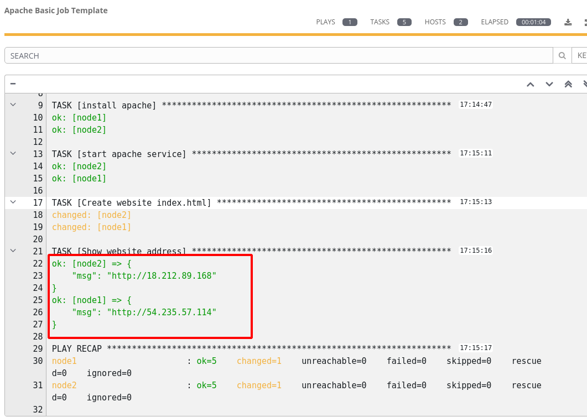

A job template is a definition and set of parameters for running an
Ansible job. Job templates are useful to execute the same job many
times.

Syncing your Project
====================

Before you can create a job template with a new playbook, you must first
sync your Project so that Tower knows about it. To do this, click
**Projects** and then click the sync icon next to your project. Once
this is complete, you can create the job template.

Creating a Job Template
=======================

Step 1:
-------

Select **Templates**

Step 2:
-------

Click the  icon, and select Job Template

Step 3:
-------

Complete the form using the following values

| Key         | Value                                        | Prompt on Launch |
|-------------|----------------------------------------------|------|
| Name        | Apache Basic Job Template                       |      |
| Description | Template for the apache basic playbook          |      |
| JOB TYPE    | Run                                          |      |
| INVENTORY   | Workshop Inventory                   |      |
| PROJECT     | Ansible Workshop Project                     |      |
| PLAYBOOK    | `iis-basic/install_iis.yml`                  |      |
| CREDENTIAL  | Type: **Machine**. Name: **Student Account** |      |
| LIMIT       | web                                      | Checked     |
| OPTIONS     | [*] ENABLE PRIVILEGE ESCALATION                      |      |
| EXTRA VARIABLES    | apache_test_message: web server test                                          | Checked     |

Step 4:
-------

Click SAVE  

Running a Job Template
======================

Now that you’ve successfully created your Job Template, you are ready to
launch it. Once you do, you will be redirected to a job screen which is
refreshing in real time showing you the status of the job.

Step 1:
-------

Select TEMPLATES

> **Note**
>
> Alternatively, if you haven’t navigated away from the job templates
> creation page, you can scroll down to see all existing job templates

Step 2:
-------

Click the rocketship icon  for the
**Apache Basic Job Template**

Step 3:
-------

When prompted, You can change the test message we can also change the scope from the web servers to a single node if desired.

Step 4:
-------

Select **NEXT** and preview the inputs.

Step 5:
-------

Select LAUNCH 

Step 6:
-------

Sit back, watch the magic happen

One of the first things you will notice is the summary section. This
gives you details about your job such as who launched it, what playbook
it’s running, what the status is, i.e. pending, running, or complete.

Next you will be able to see details on the play and each task in the
playbook.

Step 7:
-------

When the job has successfully completed, you should see a URL to your website printed at the bottom of the job output.

If all went well, you should see something like this, but with your own
custom message of course.

Extra Credit
============

Now that you have Apache Installed, create a new playbook called
*remove\_apache.yml* to stop and remove Apache.

**Hint:** First stop the `httpd` service using the `service` module,
then delete the `httpd` package using the `yum` module.
Optionally, use the `file` module to delete the index page.

End Result
==========

At this point in the workshop, you’ve experienced the core functionality
of Ansible Tower. But wait… there’s more! You’ve just begun to explore
the possibilities of Ansible Tower. The next few lessons will help you
move beyond a basic playbook.
