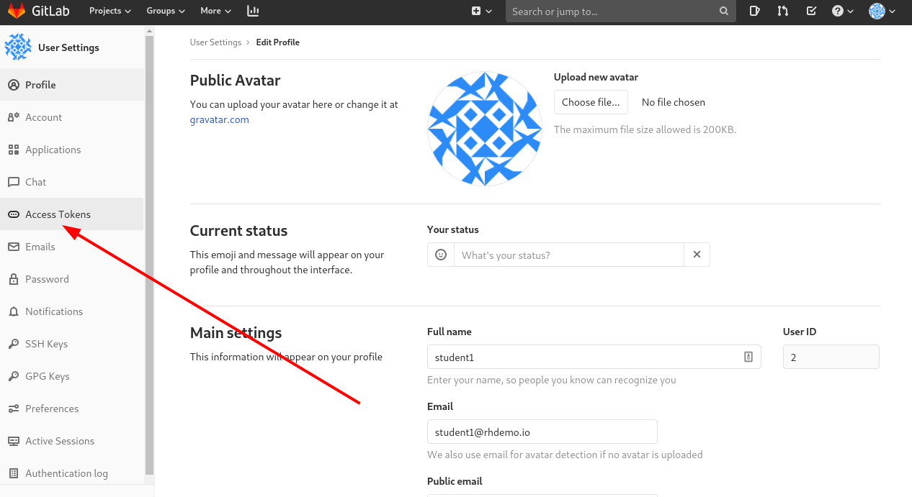
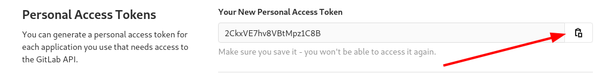
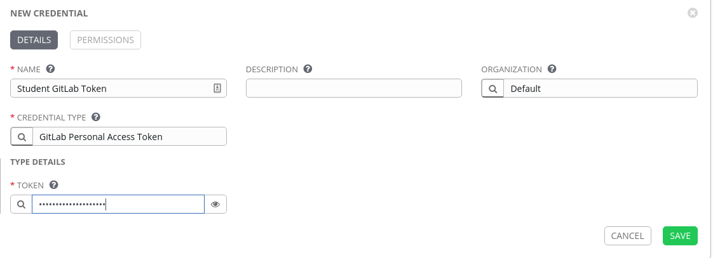
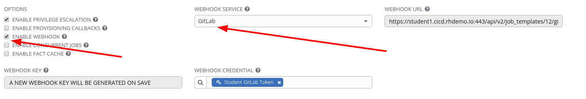
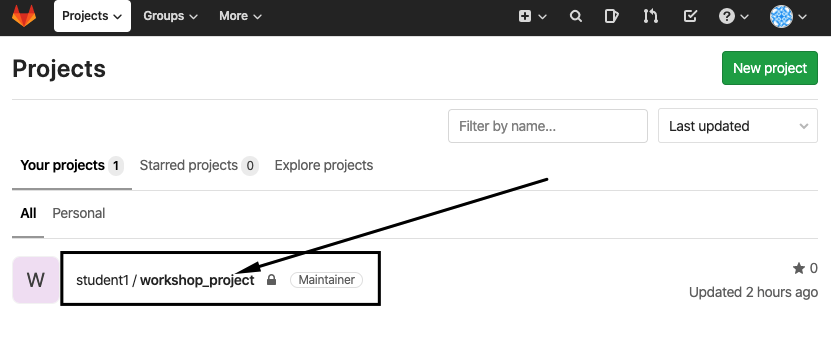

Configuring GitLab
=========================

Now that we have Ansible Tower configured to pull down our initial repository from Gitlab, we want to configure Gitlab and Tower so that the communication is bi-directional, thus at the end of this section we should be able to perform a git commit and see it automaticatlly tell Tower to kick off a job template it is referenced from.

Logging into Gitlab
==================

Your GitLab url and credentials were supplied to you on the page created for this workshop.

Creating a Personal Access Token
=============================
Step 1:
-------
In GitLab click on your user icon and select settings

Step 2:
-------
Now Select the Access Tokens menu

Step 3:
-------
Fill out the form

| Key          | Value           |
|--------------|-----------------|------------------------------------------|
| Name         | Student Tower Token|                                          
| Expires at | Leave Blank                 |
| Scope         | API

Step 4:
-------
Click on Create personal access token.

Step 5:
-------
Once created make sure to copy the token as it will become a hidden secret afterwards.

Create Gitlab Token Credential in Tower
========================

Go to Credentials in Tower and create a new credential

Step 6:
-------

Select CREDENTIALS from the left hand panel under resources

Step 7:
-------

Click the  icon and add new credential

Step 8:
-------

Complete the form using the following entries:

| Key          | Value           
|--------------|-----------------|------------------------------------------|
| Name         | Studen GitLab Token |                                          |
| Organization | Default         |                                          |
| Type         | GitLab Personal Access Token         |                                          |
| TOKEN     | **Replace # with your student number**   |        | 

Step 9:
-------

Select SAVE   

Enable Webhook to our Install Apache Job Template
========================

Lets go back to our Apache Basic Job Template and reconfigure it for bi-directional communication to GitLab.

Under Options we want to select **ENABLE WEBHOOK**

Select SAVE   

After saving we can have the **WEBHOOK** URL and **WEBHOOk KEY**

We need to copy these and add them to GitLab

Enable Webhook to our GitLab Project
==================

Navigate in GitLab to our Project and select on the left hand verticle Settings and then Webhooks

Copy the URL from tower to **URL** and the WEBHOOK KEY to **Secret Token**
Set the trigger to be on **Push events** and lock it to the **master** branch

Select Add webhook 

Testing

Creating a Project
==================

A Project is a logical collection of Ansible playbooks, represented in
Tower. You can manage playbooks and playbook directories by either
placing them manually under the Project Base Path on your Tower server,
or by placing your playbooks into a source code management (SCM) system
supported by Tower, including Git, Subversion, and Mercurial.

Step 1:
-------
A **Project** is a logical collection of Ansible playbooks, represented in Tower. 

You can manage playbooks and playbook directories by either placing them manually on your Tower server, or by placing your playbooks into a source code management (SCM) system supported by Tower, including Git, Subversion, Mercurial, and Red Hat Insights.

In this environment, playbooks are stored in a git repository available on the workshop GitLab instance. Before a **Project** can be created in Ansible Tower, the git URL for the repository is needed. In order to obtain the URL to your project, login to the GitLab instance, select your workshop project and copy the `https` url presented after clicking the "Clone" button.

The repo url will be used in **Step 3**

Step 2:
-------

Click **Projects** on the left hand panel.

Click the  icon and add new project

Step 3:
-------

Complete the form using the following entries (**using your student
number in SCM URL**)

| Key            | Value                                                                   |                                                   |
|----------------|-------------------------------------------------------------------------|---------------------------------------------------|
| Name           | Ansible Workshop Project                                                |                                                   |
| Description    | Workshop playbooks                                                      |                                                   |
| Organization   | Default                                                                 |                                                   |
| SCM Type       | Git                                                                     |                                                   |
| SCM URL        | https://gitlab.**WORKSHOP**.rhdemo.io/**student#**/workshop_project.git | URL obtained from Step 1                          |
| SCM BRANCH     |                                                                         | Intentionally blank                               |
| SCM CREDENTIAL | Git Credential                                                          |                                                   |

SCM UPDATE OPTIONS

- [ ] Clean
- [ ] Delete on Update
- [x] Update Revision on Launch

Step 4:
-------

Select SAVE 

Step 5:
-------

Scroll down and validate that project has been successfully synchronized
against the source control repo upon saving. You should see a green icon
next to the project name in the list view at the bottom of the page.

Inventories
===========

An inventory is a collection of hosts against which jobs may be
launched. Inventories are divided into groups and these groups contain
the actual hosts. Inventories may be sourced manually, by entering host
names into Tower, or from one of Ansible Tower’s supported cloud
providers.

A static Inventory has already been created for you today. We will now
take a look at this inventory to show case the various features.

Step 1:
-------

Click **Inventories** from the left hand panel. You will see the
preconfigured Inventory listed. Click the Inventories' name **Workshop 
Inventory** or the Edit button. 

Step 2:
-------

You will now be viewing the Inventory. From here you can add Hosts,
Groups, or even add Variables specific to this Inventory.

We will be viewing the hosts, so click the **HOSTS** button.

Step 3:
-------

In the Hosts view, we can see every host associated with this
inventory. You will also see which groups a host is associated with.
Hosts can be associated with multiple groups. These groups can later
then be used to narrow down to the exact hosts we will later run our
playbooks on.

Step 4:
-------

If you click the **GROUPS** button and then select the **web** group, you can inspect variables set at the group level that will apply to all hosts in that group.

Today, we have already defined a handful of variables to tell Ansible how to connect to hosts in this group. You do not have to define these variables as
a Group variable here, they could also be Host variables or reside
directly in your Template or Playbook. However, because these variables will be the same for **ALL** web hosts in our environment, we defined them for the entire web group.

If you click the **HOSTS** button, you can view the hosts belonging to the windows group. If you click the link for the host on this page, you can view the host specific variables that have been defined.

**`ansible_host`**

This is the IP address of this particular server

**`ansible_password`** 

This is the password needed to connect to this server

**`ansible_user`**

This is the username that Ansible will use along with the password to connect to this server

These variables are very host specific thus have been defined at the host level instead of at the group level.

The authentication settings are particularly important and you will need
to review them and decide which method is best for your needs.
